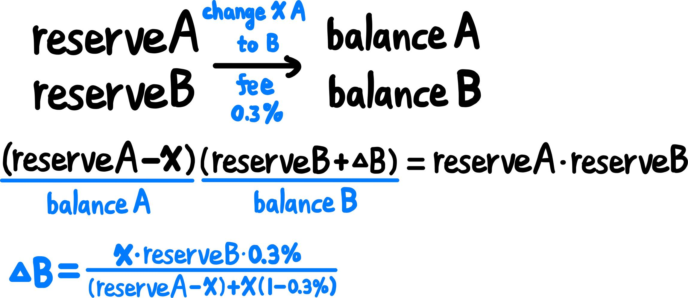

# 2024-Spring-HW2

Please complete the report problem below:

## Problem 1
Provide your profitable path, the amountIn, amountOut value for each swap, and your final reward (your tokenB balance).

> Solution

profitable path : tokenB->tokenA->tokenD->tokenC->tokenB

tokenB->tokenA : 

amountIn-5 , amountOut-5.655321988655322

tokenA->tokenD : 

amountIn-5.655321988655322 , amountOut-2.4587813170979333

tokenD->tokenC : 

amountIn-2.45878131709793335 , amountOut-5.0889272933015155

tokenC->tokenB : 

amountIn-5.0889272933015155 , amountOut-20.129888944077443

final reward (tokenB balance) : 20.129888944077443

 

## Problem 2
What is slippage in AMM, and how does Uniswap V2 address this issue? Please illustrate with a function as an example.

> Solution

Slippage is the difference between the expected price and the actual price of a trade.

Uniswap V2 addressed this issue by using "constant product invariant", which ensures the product of the reserve amounts of the two tokens in a trading pair remains constant. When trades occur, the ratio of the reserve amounts changes to maintain this product, which in turn helps to minimize slippage. 

## Problem 3
Please examine the mint function in the UniswapV2Pair contract. Upon initial liquidity minting, a minimum liquidity is subtracted. What is the rationale behind this design?

> Solution

The rationale behind subtracting a minimum liquidity upon initial minting is aim to require users to provide a minimum amount of liquidity, in order to ensure price stability, efficient trading, and to avoid market manipulation.

## Problem 4
Investigate the minting function in the UniswapV2Pair contract. When depositing tokens (not for the first time), liquidity can only be obtained using a specific formula. What is the intention behind this?

> Solution

The intention behind this specific formula is to maintain the constant product invariant, which ensures the product of the reserves of the two tokens in the liquidity pool remain constant all the time, which can minimizing slippage for traders. 

## Problem 5
What is a sandwich attack, and how might it impact you when initiating a swap?

> Solution

A sandwich attack is a type of front-running attack that occur in decentralized exchanges. In a sandwich attack, attacker places two transactions around a target transaction in quick succession, aiming to exploit the price movement caused by the target transaction, which can let the attacker profit.

Sandwich attack can make me paying higher prices, acquiring fewer assets, experiencing slower transaction speeds, and facing increased transaction costs when initiating a swap. 
